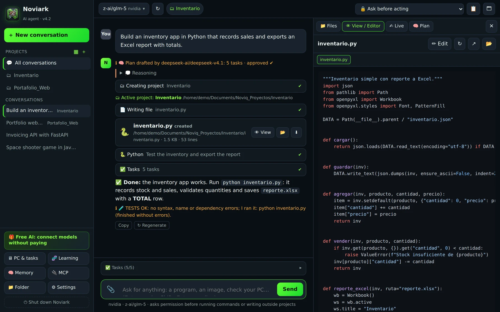
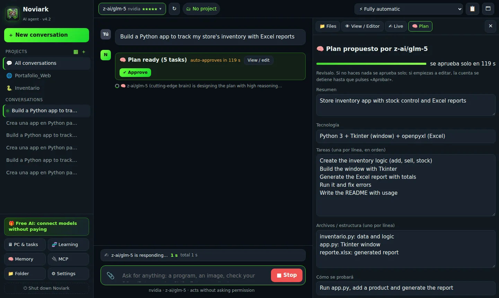
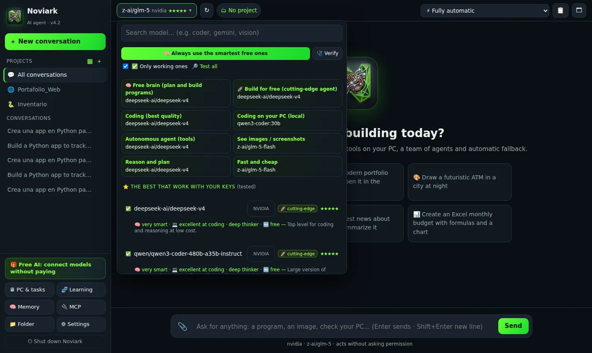
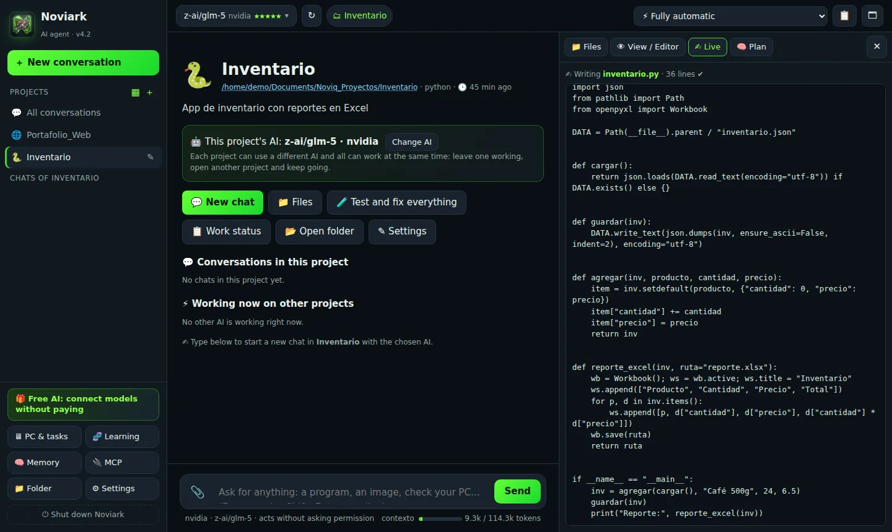

<p align="center"></p>
<h1 align="center">Noviark</h1>
<p align="center">
<b>The autonomous AI agent your company controls.</b><br>
<b>El agente de IA autónomo que tu empresa controla.</b>
</p>

<p align="center">
<a href="https://github.com/JUXN1988/noviark/releases/latest"></a>
<a href="https://github.com/JUXN1988/noviark/releases"></a>

<a href="LICENSE.md"></a>
<a href="https://github.com/JUXN1988/noviark/actions/workflows/release.yml"></a>
</p>

<p align="center">
<a href="#-download"><b>⬇ Download</b></a> ·
<a href="#-descargar"><b>⬇ Descargar</b></a> ·
<a href="#-features">Features</a> ·
<a href="ROADMAP.md">Roadmap</a> ·
<a href="CHANGELOG.md">Changelog</a> ·
<a href="LICENSE.md">License</a> ·
<a href="#-español">Español</a>
</p>

<p align="center"></p>

Noviark is a desktop app that **plans, writes, runs, tests and fixes software end to end**. You describe what you want; the agent creates the project, writes the code, runs it, reads the errors and repairs them until it works. It works with **any AI model** — cloud providers such as NVIDIA NIM, Google Gemini or OpenRouter, or **local models that never leave your network** (Ollama, LM Studio) — so there is no vendor lock-in and your code stays in-house.

## ⬇ Download

| System | Download | Notes |
|---|---|---|
| **Windows 10 / 11** (64-bit) | [**Noviark-Setup-Windows.exe**](../../releases/latest/download/Noviark-Setup-Windows.exe) | Installer with Start-menu and desktop shortcuts. Portable: [Noviark-Windows-portable.zip](../../releases/latest/download/Noviark-Windows-portable.zip) |
| **macOS** — Apple Silicon (M1–M4) | [**Noviark-macOS-arm64.dmg**](../../releases/latest/download/Noviark-macOS-arm64.dmg) | Drag Noviark to Applications |
| **macOS** — Intel | [**Noviark-macOS-x86_64.dmg**](../../releases/latest/download/Noviark-macOS-x86_64.dmg) | Drag Noviark to Applications |
| **Ubuntu / Debian** (amd64) | [**Noviark-Linux-amd64.deb**](../../releases/latest/download/Noviark-Linux-amd64.deb) | `sudo apt install ./Noviark-Linux-amd64.deb` · Other distros: [Noviark-Linux-x86_64.tar.gz](../../releases/latest/download/Noviark-Linux-x86_64.tar.gz) |

All versions: [Releases](../../releases).

**First launch**
- **Windows**: if SmartScreen shows "Windows protected your PC", click **More info → Run anyway** (the installers are not code-signed yet; signing is planned for v4.5).
- **macOS**: right-click Noviark in Applications → **Open** → **Open**. Or: System Settings → Privacy & Security → **Open Anyway**.
- **Linux**: open **Noviark** from your applications menu, or run `noviark` in a terminal.

Then go to **⚙ Settings → Providers & keys**, paste one or more API keys (or use **🎁 Free AI**, or point it at Ollama / LM Studio) and start a conversation.

## ✨ Features

- **Autonomous agent with 38+ real tools** — files, PowerShell, Python, Linux (WSL), Docker, virtual environments, installers, HTTP, web search, browser and desktop automation, image generation and screen vision.
- **Planning brain + approvable plan** — the strongest reasoning model drafts the plan; you edit or approve it before anything runs (auto-approval after a countdown you control). The plan updates live as tasks finish.
- **Debugs like an expert** — `diagnose` returns a prioritized list of real problems with file:line; `test_web` opens web apps and games in an invisible browser and reports JavaScript errors, missing files, blank canvases and whether controls respond.
- **Reasoning guardian** — if a model thinks too long without acting, or loops, Noviark cuts it off, summarizes, and makes it act.
- **Escalation to the most capable model** — when the agent gets stuck, work is handed to the smartest model you have enabled, with full state and diagnosis.
- **Never starts from zero** — a work state (goal, plan, done, files, errors, next step) is kept for every conversation. If a model fails, runs out of quota or stops answering, the next one continues exactly where it stopped.
- **20+ AI providers**, verified live — NVIDIA NIM, Google Gemini, OpenAI, Anthropic, OpenRouter, Groq, DeepSeek, Mistral, xAI, Cloudflare, Hugging Face and any OpenAI-compatible API. Several keys per provider with automatic rotation. The model list shows only models that actually work, best first.
- **Local AI** — Ollama and LM Studio, with context size tuned automatically to your VRAM/RAM and a compact mode for small models.
- **Parallel projects**, each with its own screen and its own model; import projects you already have.
- **Continuous learning** from errors and the fixes that worked.
- **MCP servers** — same config format as Claude Desktop.
- **Guardrails** — permission levels (ask / auto / full auto), automatic restore points and undo, deletions go to the Recycle Bin, a secret scanner, and an **encrypted key vault** (Windows DPAPI).
- **Native app window** in **English and Spanish**, detected automatically.

<p align="center">


</p>
<p align="center"></p>

## 🔐 Privacy and security

- Noviark runs on **your** computer. Your code and files are only sent to the AI provider **you** choose — or to nobody, if you use local models.
- API keys are stored in `claves.vault`, encrypted with Windows DPAPI (only your Windows user on that PC can decrypt it). Keys are never shown in full on screen.
- The agent asks for permission before running commands, deleting files or writing outside the projects folder, unless you choose otherwise.
- Found a vulnerability? See [SECURITY.md](SECURITY.md).

## 🛠 Run from source

Requires **Python 3.10+**.

```bash
git clone https://github.com/JUXN1988/noviark.git
cd noviark
# Windows: double-click iniciar.bat   (creates .venv and opens the app)
# Linux / macOS:
bash iniciar.sh
```

The app serves its UI on `http://127.0.0.1:7860` and opens it in a native window.

### Build the installers

```bash
packaging\windows\build.bat      # Windows → dist\Noviark-Setup-Windows.exe + portable .zip (needs Inno Setup 6)
bash packaging/linux/build.sh    # Ubuntu  → dist/Noviark-Linux-amd64.deb + .tar.gz
bash packaging/macos/build.sh    # macOS   → dist/Noviark-macOS-<arch>.dmg
```

Pushing a tag like `v4.2.0` makes **GitHub Actions** build all installers (Windows, Linux, macOS Apple Silicon and Intel) and publish them in a Release.

## 🗺 Roadmap

Signed installers and auto-update (v4.5), admin console + SSO + audit log (v5.0), agents for documents and office work (v5.5), and compact models fine-tuned for local coding (v6). Details in [ROADMAP.md](ROADMAP.md).

## 📄 License

Noviark is **free for personal, educational, research and non-profit use**. Companies can **evaluate it free for 60 days**, then need a commercial license. The source code is available for review and learning. See [LICENSE.md](LICENSE.md).

**Enterprise licenses, pilots, private deployment, investment or acquisition:** contact **Noviark Labs** by opening an issue labeled *business*, or via the website.

---

## 🇪🇸 Español

Noviark es un programa de escritorio que **planifica, escribe, ejecuta, prueba y corrige software de punta a punta**. Le dices qué quieres; el agente crea el proyecto, escribe el código, lo ejecuta, lee los errores y los arregla hasta que funciona. Funciona con **cualquier modelo de IA**: en la nube (NVIDIA NIM, Google Gemini, OpenRouter…) o **100 % dentro de tu red** con modelos locales (Ollama, LM Studio). Sin atarte a un proveedor y sin que tu código salga de casa.

### ⬇ Descargar

| Sistema | Descarga | Notas |
|---|---|---|
| **Windows 10 / 11** (64 bits) | [**Noviark-Setup-Windows.exe**](../../releases/latest/download/Noviark-Setup-Windows.exe) | Instalador con accesos en Inicio y Escritorio. Portable: [Noviark-Windows-portable.zip](../../releases/latest/download/Noviark-Windows-portable.zip) |
| **macOS** con Apple Silicon (M1–M4) | [**Noviark-macOS-arm64.dmg**](../../releases/latest/download/Noviark-macOS-arm64.dmg) | Arrastra Noviark a Aplicaciones |
| **macOS** con Intel | [**Noviark-macOS-x86_64.dmg**](../../releases/latest/download/Noviark-macOS-x86_64.dmg) | Arrastra Noviark a Aplicaciones |
| **Ubuntu / Debian** (amd64) | [**Noviark-Linux-amd64.deb**](../../releases/latest/download/Noviark-Linux-amd64.deb) | `sudo apt install ./Noviark-Linux-amd64.deb` · Otras distros: [Noviark-Linux-x86_64.tar.gz](../../releases/latest/download/Noviark-Linux-x86_64.tar.gz) |

**La primera vez**
- **Windows**: si aparece «Windows protegió su PC», pulsa **Más información → Ejecutar de todas formas** (los instaladores aún no están firmados; la firma llega en la v4.5).
- **macOS**: clic derecho sobre Noviark en Aplicaciones → **Abrir** → **Abrir**. O en Ajustes del Sistema → Privacidad y seguridad → **Abrir igualmente**.
- **Linux**: abre **Noviark** desde el menú de aplicaciones o escribe `noviark` en la terminal.

Luego entra en **⚙ Ajustes → Proveedores y claves**, pega una o varias API keys (o usa **🎁 IA gratis**, u Ollama / LM Studio) y empieza a conversar.

### ✨ Qué hace

- **Agente autónomo con más de 38 herramientas reales**: archivos, PowerShell, Python, Linux (WSL), Docker, entornos virtuales, instaladores, HTTP, búsqueda web, automatización del navegador y del PC, generación de imágenes y visión de pantalla.
- **Cerebro planificador y plan aprobable**: el modelo que mejor razona diseña el plan y tú lo editas o lo apruebas antes de ejecutarlo. El plan se actualiza en vivo.
- **Depura como un experto**: `diagnosticar` da la lista priorizada de problemas reales con archivo:línea; `probar_web` abre webs y juegos en un navegador invisible y reporta errores de JavaScript, archivos que no cargan, pantallas vacías y si los controles responden.
- **Guardián de razonamiento**: si la IA piensa demasiado sin actuar o entra en bucle, Noviark la corta, resume y la obliga a actuar.
- **Escalado a la IA más capaz**: si el agente se atasca, el trabajo pasa a la IA más inteligente que tengas habilitada, con todo el estado.
- **Nunca empieza de cero**: si una IA falla, agota su cuota o deja de responder, la siguiente continúa exactamente donde quedó.
- **20+ proveedores de IA** verificados en vivo, varias claves por proveedor con rotación automática, y solo se muestran los modelos que funcionan.
- **IA local** con Ollama y LM Studio, ajustada automáticamente a tu VRAM y RAM.
- **Proyectos en paralelo**, cada uno con su pantalla y su propia IA.
- **Aprendizaje continuo**, **servidores MCP**, **permisos por nivel de riesgo**, **puntos de restauración** y **bóveda cifrada de claves**.
- **Ventana nativa** en **español e inglés**, con detección automática del idioma.

<p align="center"></p>

Guía completa en español: [LEEME.md](LEEME.md).

### 📄 Licencia

**Gratis para uso personal, educativo, de investigación y ONG.** Las empresas pueden **evaluarlo 60 días gratis** y luego necesitan una licencia comercial. Ver [LICENSE.md](LICENSE.md).

**Licencias para empresas, pilotos, instalación privada, inversión o adquisición:** escribe a **Noviark Labs** abriendo un issue con la etiqueta *business* o desde la web.

---

<p align="center">© 2026 Noviark Labs</p>
